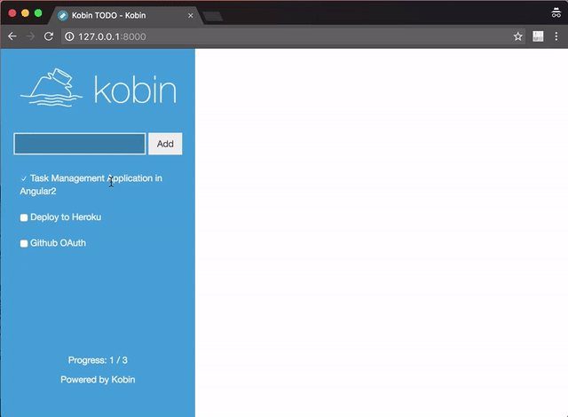

=====
Kobin
=====

.. image:: https://travis-ci.org/kobinpy/kobin.svg?branch=master
   :target: https://travis-ci.org/kobinpy/kobin

.. image:: https://badge.fury.io/py/kobin.svg
   :target: https://badge.fury.io/py/kobin

.. image:: https://coveralls.io/repos/github/kobinpy/kobin/badge.svg?branch=coveralls
   :target: https://coveralls.io/github/kobinpy/kobin?branch=master

.. image:: https://codeclimate.com/github/c-bata/kobin/badges/gpa.svg
   :target: https://codeclimate.com/github/kobinpy/kobin
   :alt: Code Climate

.. image:: https://readthedocs.org/projects/kobin/badge/?version=latest
   :target: http://kobin.readthedocs.org/en/latest/?badge=latest
   :alt: Documentation Status

A Minimal WSGI Framework to develop your web application comfortably.
**This library is a pre-release. Expect missing docs and breaking API changes.**

Kobin has following features.

- Decorator based Routing System exploited Type Hints.
- WSGI request and response Wrapper.
- Provide type annotations from stub files.
- and other convenient utilities...

And Kobin has **NO** following features:

- *WSGI Server Adapters*: Please use WSGICLI or Gunicorn CLI.
- *Serving static contents*: Please use WSGICLI and Nginx.
- *Template Engine*: But Kobin provides template adapter for Jinja2.

Requirements
============

Supported python versions are python 3.5 or 3.6(beta).
And Kobin has no required dependencies other than the Python Standard Libraries.

The following packages are optional:

* wsgicli - Command Line Interface for developing WSGI application.
* jinja2 - Jinja2 is a full featured template engine for Python.

Resources
=========

* `Documentation (English) <https://kobin.readthedocs.org/en/latest/>`_
* `Documentation (Japanese) <https://kobin.readthedocs.org/ja/latest/>`_
* `Github <https://github.com/kobinpy/kobin>`_
* `PyPI <https://pypi.python.org/pypi/kobin>`_
* `Kobin Example <https://github.com/kobinpy/kobin-example>`_

Kobin's documentation is not yet complete very much.
If you want to know the best practices in Kobin,
Please check  `Kobin Example <https://github.com/kobinpy/kobin-example>`_ .

License
=======

This software is licensed under the MIT License (See `LICENSE <./LICENSE>`_ ).
